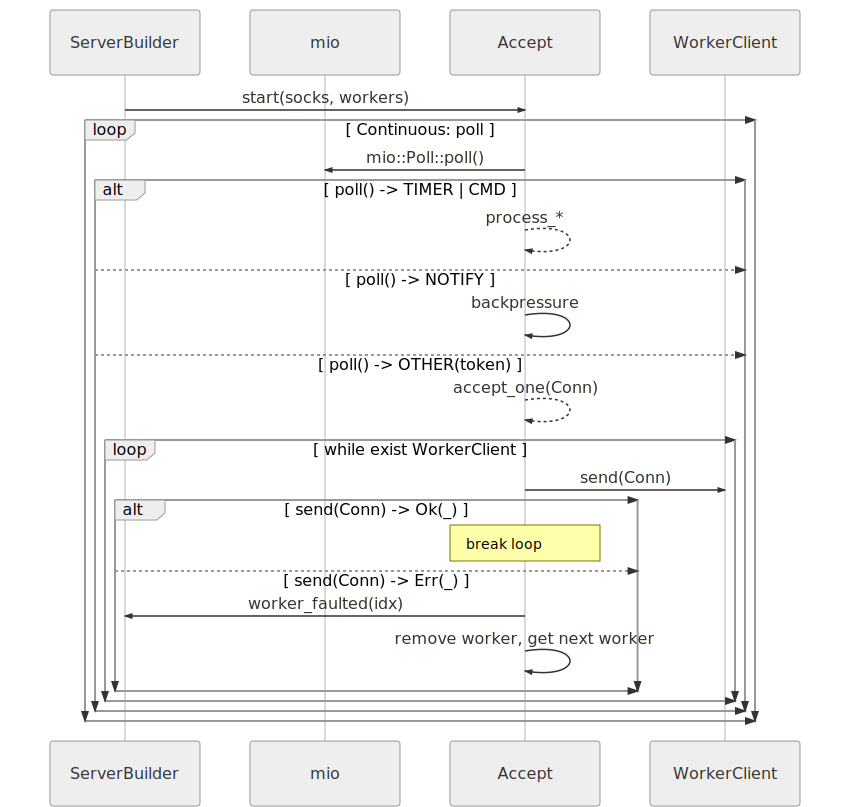
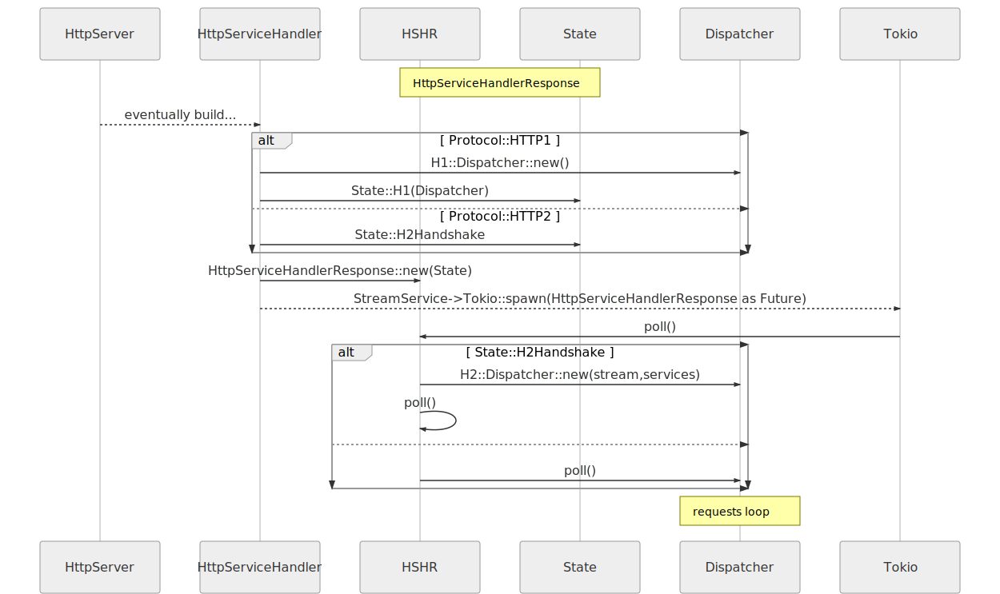

# URL 链接生命周期

> [conn_lifecycle.md](https://github.com/actix/actix-website/blob/master/content/docs/conn_lifecycle.md)
>  
> commit - 69145efc1e401e3974f7957f186e55d1d7ab4860 - 2020.02.02

## 架构总览

在服务器开始监听所有套接口（socket）之后，[`Accept`][Accept] 和 [`Worker`][Worker] 是两个主要的循环，负责处理传入的客户端连接。

一旦连接被接受，应用程序级别的协议处理将发生在指定协议的 [`Dispatcher`][Dispatcher] 循环，[`Dispatcher`][Dispatcher] 循环派生于 [`Worker`][Worker]。

    请注意，下面的图表仅展示了“一路畅通”的理想场景。

### Accept 循环细节

参阅 [`actix-server`][server] crate，详细了解结构体 [`Accept`][Accept]。

### Worker 循环细节

参阅 [`actix-server`][server] crate，详细了解结构体 [`Worker`][Worker]。

### Request 循环概览

参阅 [`actix-web`][web] crate 和 [`actix-http`][http] crate，详细了解 Request 循环。

[server]: https://crates.io/crates/actix-server
[web]: https://crates.io/crates/actix-web
[http]: https://crates.io/crates/actix-http
[Accept]: https://github.com/actix/actix-net/blob/master/actix-server/src/accept.rs
[Worker]: https://github.com/actix/actix-net/blob/master/actix-server/src/worker.rs
[Dispatcher]: https://github.com/actix/actix-web/blob/master/actix-http/src/h1/dispatcher.rs
